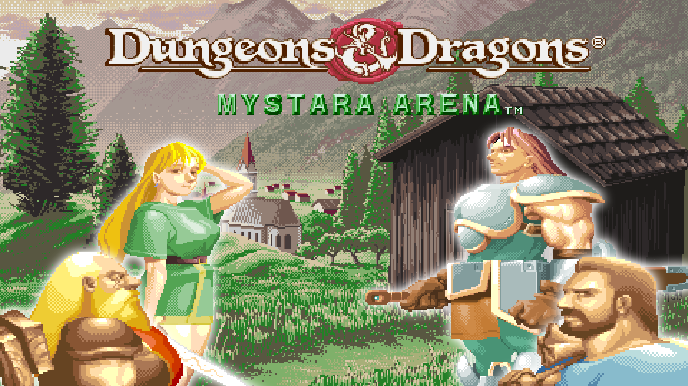
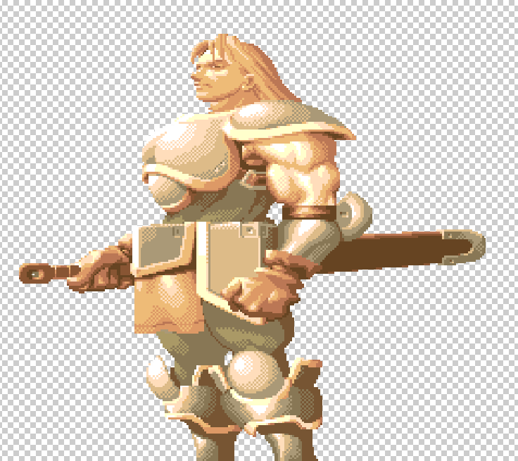
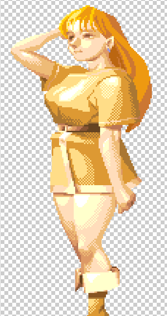

# Mystara-Arena-Personal-Page

Hi, I'm Joel Cabaco and on this page I will go through the development of Mystara Arena from my part. I'll explain my contributions to the game as well as my function on the team.

As the Quality Assurance responsible, my first contribution to the team was to create the QA Plan document that would have to be followed during the development in order to keep the game playable while still making progress. Said QA Plan can be found [here](https://github.com/NOREADMEStudios/ProjectII/wiki/7.-QA-Plan).

The plan wasn't followed as strictly as it should during the game's development, but some intense bugfixing sprints were made at the end of each version (excluding alpha) to make up for it. Github Issues proved to be an essential tool in this process, since it provided an easy way to classify and assign bugfixes, enhancements or other improvements to the game that needed to be made.

---

Even though my assigned role was as the QA responsible, I also helped with the design of the game, contributed on the GDD, and did a large part of the game HUD's art. As for design, I made the [character design document](https://docs.google.com/document/d/161GctLFCBrmuUe6hATSU3c1YE4NHPJU_2VzHuSmFAC8/edit?usp=sharing) after we were told by the publisher to change the game's mechanics, in cooperation with [_Pol Carrera_](https://github.com/PolCarCat), and I also did a little [document](https://docs.google.com/document/d/1G8DMtu8iAIJ1iuQ1AI80mhGkVVN1J4CwUCQvT_OM29k/edit?usp=sharing) with the function of the items in the final version of the game, as well as with some information for the programmer to implement them easily.

---

At the middle of the game's development I found that the art of the game wasn't really appealing, so I offered myself to do part of it to try to make the game more interesting visually. I did a background for the game's menus using free images and sprites found in _D&D: Shadow over Mystara_ and its predecessor, _Tower of Doom_, though as the rogue (elf) and warrior had a really pale and boring palette (due to technology limitations in 1997), I "revamped" their sprites to make them more kind to their regular palette, and added a sword to the rogue's hand.

---

_Original warrior sprite_

---

_Original elf sprite, called "Rogue" in Mystara Arena_

---
